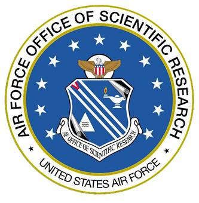
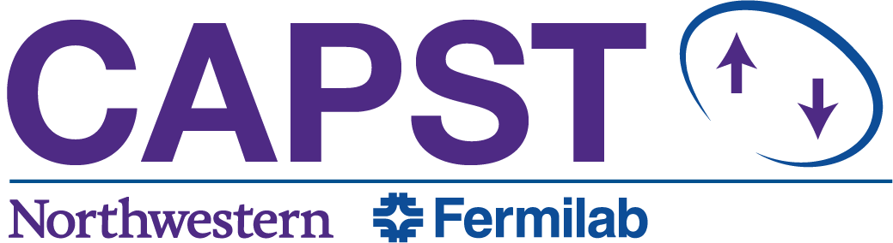

.. datapyc
   Copyright (C) 2020, Jens Koch

.. _acknowledgments:

***********************
Funding Acknowledgments
***********************

Development of datapyc was partially supported by the Air Force Office of Scientific Research (AFOSR) under
Grant no. W911NF-15-1-0421, by Northwestern University, and by Northwestern's Center for Applied Physics and
Superconducting Technologies.

|

.. figure:: graphics/NU-logo.png
   :align: center
   :width: 2.0in
   :target: https://www.northwestern.edu

|

