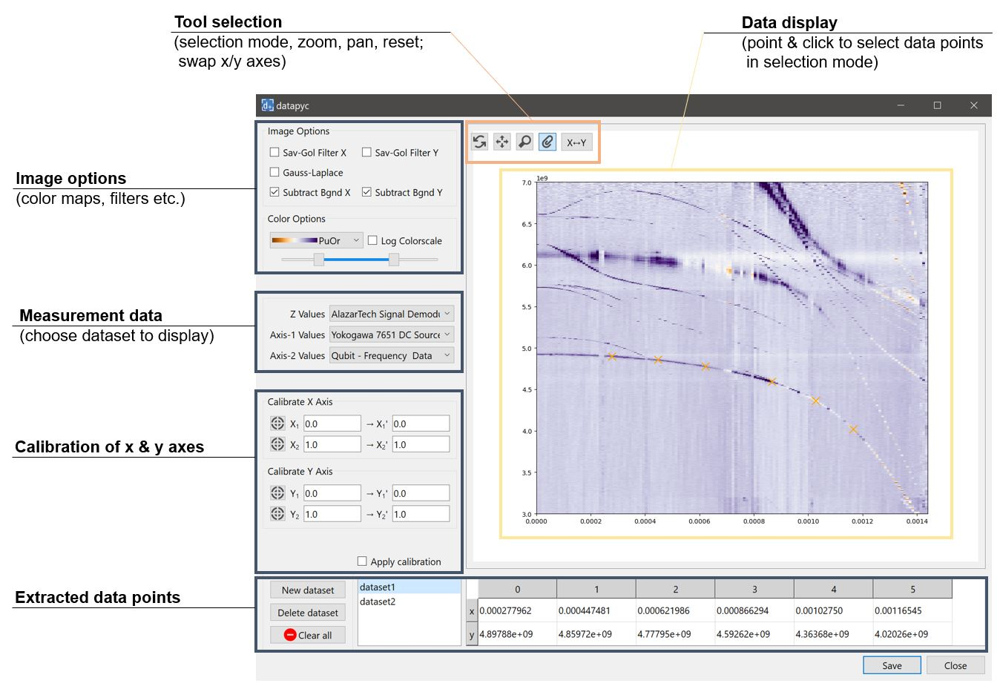
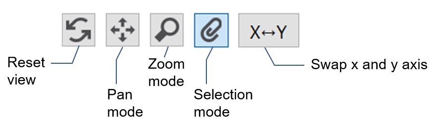
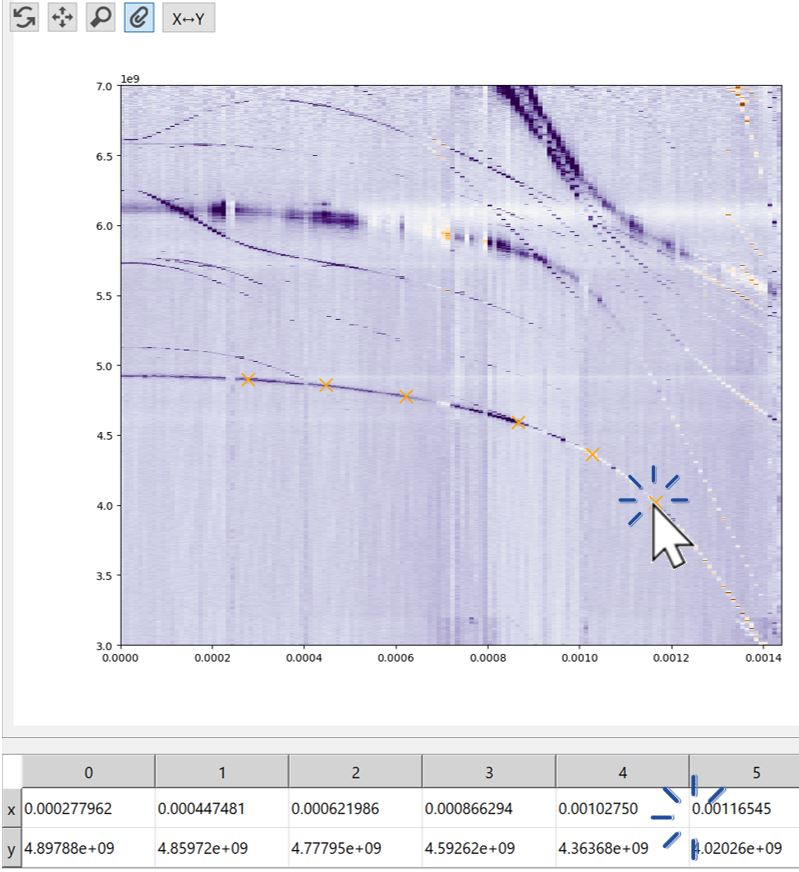
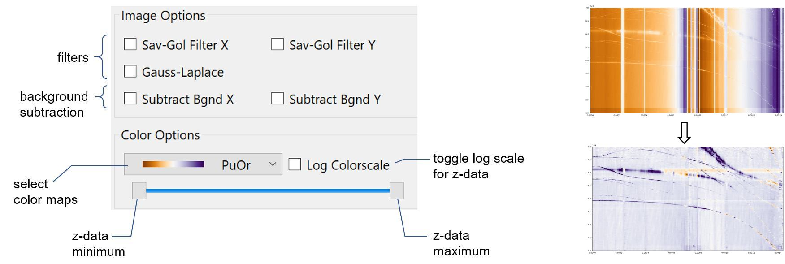
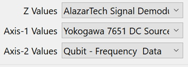
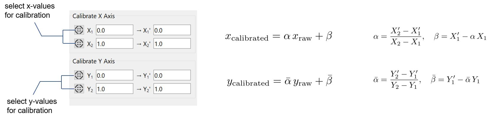

.. datapyc
   Copyright (C)  2020, Jens Koch

.. _guide:

*******************
Users Guide
*******************

.. toctree::
   :maxdepth: 2

.. _run:

Running datapyc
====================

Following installation, datapyc is started from the command line like this:

.. code-block:: bash

   python -m datapyc

.. _import:

Data import
====================

Once launched, datapyc displays a dialog window for selecting a data file to be opened.
As a concrete example, such data might represent a spectroscopy scan recording
the transmission amplitude (the stored z-axis data) as a function of probe frequency (x axis) and magnetic flux (y axis).

The list of supported file formats includes Labber, Matlab, generic hdf5 files, as well as common image file formats.
See :ref:`dataformats` for details.

.. _main:

Interface
===========

Once measurement data has been imported, it is displayed in the main window. The graphical interface consists of several
elements:

.. _tools:

Tool/mode selection
=====================

The group of four buttons on the top lets the user switch between selection, zoom, and pan mode, reset the data view,
and swap the x- and y-axes. (Swapping axes is enabled for numerical measurement data, but is disabled for data imported
from images/)

Selection mode is used for selecting data point by simple point & click on the displayed measurement data.

.. _point-click:

Extract data points (point & click)
=======================================

With selection mode active, point the mouse cursor to the position of a data point to be extracted, then click.
A marker is placed on the canvas, and the data point is recorded in the data table.

An extracted point can be deleted by clicking on an existing marker.

.. note::

   When extracting data points from spectroscopy data for fitting, always group data points belonging to one and the
   same transition. Create a new data set for the next transition.

.. _imageoptions:

Increase visibility of data features
=======================================

Visibility of features in the displayed measurement data can often be greatly enhanced by adjusting the available
options such as color maps, z-data plot range etc.

.. _selectdata:

Measurement data selection
============================

If the opened data file contains multiple data sets, then the dropdown menus shown below enable switching between the
different data sets.

.. _calibrate:

Calibration of axes
=====================

Coordinates which are recorded via point and click do not necessarily reflect the values associated with the intended
x- and y-axes.  Calibration is always necessary when extracting data points from images. In other cases, recalibration
may be convenient, e.g., from Hz to GHz or yoko-volts to magnetic flux quanta.

Extracted points displayed in the data table are either shown in raw form, or in calibrated form, depending
on whether "Apply calibration" is deselected or selected.

Calibration is performed separately for x- and y-axis. To establish calibration of the x-axis two (distinct)
raw x-values (:math:`X_1` and :math:`X_2`) are needed along with their corresponding calibrated counterparts
(:math:`X_1'` and :math:`X_2'`). All can be entered numerically. The raw values can also be selected by clicking the
calibration button and then pointing and clicking in the measurement data plot.

The analogous procedure is used for calibration of the y-axis.
