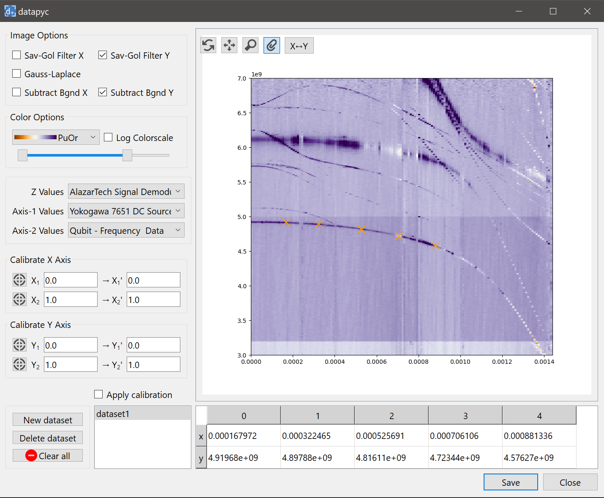

.. datapyc
   Copyright (C) 2020, Jens Koch

datapyc
========

   datapyc is an open-source GUI tool for point-and-click data extraction:

- Open measurement data files (e.g., data from frequency/flux sweep of transmission).

- Extract data points for fitting by simple mouse clicks.

- Apply color maps, adjust plot range, & apply background subtraction and filters to simplify identification of resonances in the data.

- Extracted data sets can be saved and then loaded into scqubits for fitting data to a particular superconducting qubit, or coupled system of qubits and resonators.

.. toctree::
   :maxdepth: 2

   installation.rst
   guide/guide.rst
   dataformats.rst
   changelog.rst
   contributors.rst
   acknowledgments.rst
   license.rst

Indices and tables
====================

* :ref:`genindex`
* :ref:`modindex`
* :ref:`search`